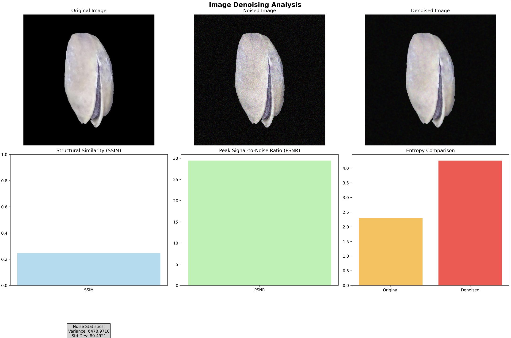

# CS 506 Midterm Report: Noise Reduction in Images

By: Ashtosh Bhandari, Varada Rohokale, Zev Fine

YouTube Link  
1. https://www.youtube.com/watch?v=AlRKTor6PYk

## Description
The aim of this project is to develop algorithms and, if time permits, deep learning models that can take noisy images, then turn them into clearer, more understandable versions. This process involves applying deep learning techniques, and reverse engineering different types of noise to try to correct the noise effects. The goal is to restore and preserve the original content as much as possible.

We aim to produce images that, while not completely perfect or perfectly restored, try to convey enough visual information to identify the main context. This is applicable to broad fields such as surveillance, medical imaging, satellite imagery, and the restoration of historical images.

## Main Goal
Reduce noise in images, making a clearer image where main ideas that might be blurred out can come through.

## Data

1. Existing image data collections such as existing data set  
   1. https://www2.eecs.berkeley.edu/Research/Projects/CS/vision/bsds/  
   2. https://www.kaggle.com/datasets/muratkokludataset/pistachio-image-dataset  
   3. https://www.kaggle.com/datasets/gpiosenka/sports-classification  
   4. https://www.kaggle.com/datasets/vishalsubbiah/pokemon-images-and-types  

2. We will artificially add noise, by using Gaussian noise, Poisson noise, Salt and Pepper noise, and Speckle noise  
   1. Preliminary Visuals of Noised Data:  
      1. Gaussian Noise  
         
      2. Poisson noise  
         
      3. Salt and Pepper  
         
      4. Speckle  
         

## Methods for Noise Reduction

1. Mathematical techniques  
   1. Gaussian Noise  
      1. Frequency Domain  
   2. Poisson Noise  
      1. Anscombe transform  
   3. Black and White Noise  
      1. Clustering methods  
   4. Speckle Noise  
      1. Log-transform followed by Gaussian smoothing  

2. Deep learning (if time)

## Data visualization
To evaluate and present results, we will show:

1. Side by side comparison — an easy way to show how good or bad our methods are is by showing before, after, and target  
2. Other ways of showing quality  
   1. SSIM  
   2. PSNR  
   3. Entropy / Noise Variance / Noise Std  
   4. Preliminary Results after Noise Reduction  
      1. Gaussian Noise  
         
3. Show RGB Differences in before and after  
4. Give specific examples — show where the reduction worked well or poorly (faces, background, building, etc)

## Test Plan

Testing comprises of:

1. Partition — Of each data set, set around 65% for training, 10% for validation, and 25% for testing  
2. Training  
   1. The portion of the data set that the models will work on  
3. Validation  
   1. We will use hyperparameter tuning until we get the best balance between denoising strength and detail preservation  
4. Testing —  
   a. Compare each image pixel by pixel to its denoised counterpart  
   b. Use existing image recognition models to see if main ideas are retained  
   i. We will run a clean image and get its classification, then run the denoised counterpart through it and get the similarity
