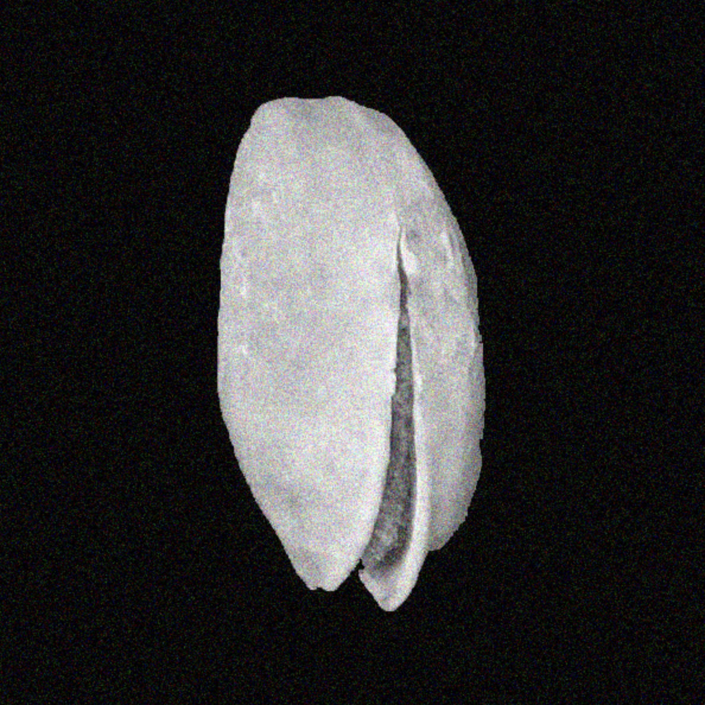
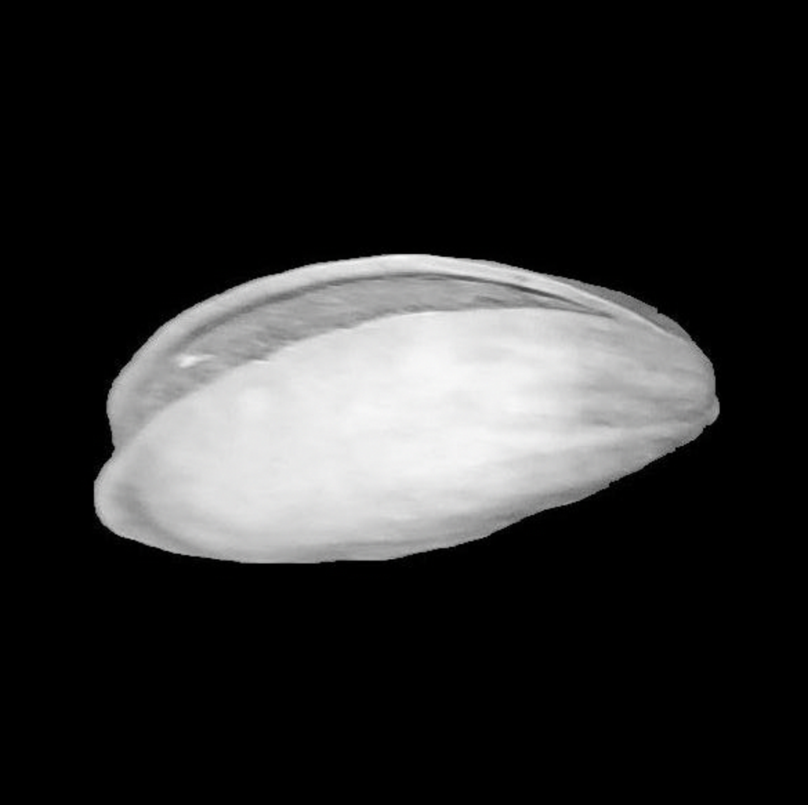
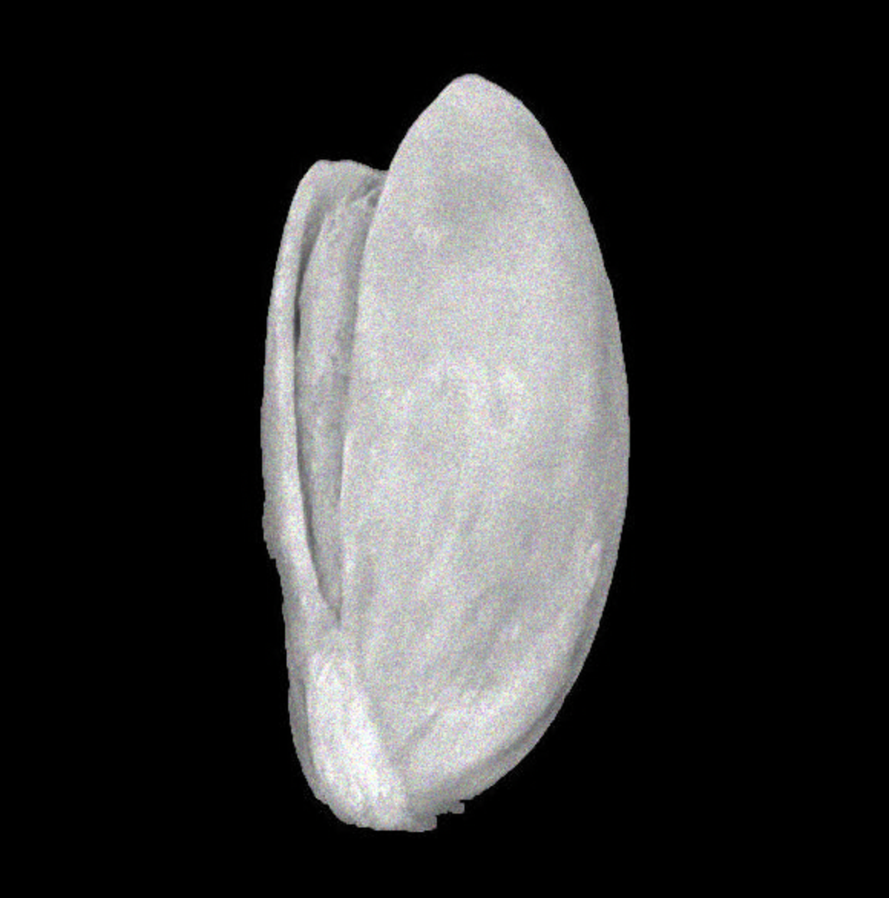

# CS 506 Final Report: Noise Reduction in Images

By: Ashtosh Bhandari, Varada Rohokale, Zev Fine
YouTube Link:

---

# Index

* [Section 1: Introduction](#section-1-introduction)
* [Section 2: Pre-Noise Metrics](#section-2-pre-noise-metrics)

  * [2.1 Approach and Methodology](#21-approach-and-methodology)
  * [2.2 Quantitative Metrics Analysis](#22-quantitative-metrics-analysis)
* [Section 3: Salt & Pepper Noise Generation](#section-3-salt--pepper-noise-generation)

  * [3.1 Approach and Methodology](#31-approach-and-methodology)
  * [3.2 Quantitative Metrics Analysis](#32-quantitative-metrics-analysis)
  * [3.3 Denoising Goals](#33-denoising-goals)
* [Section 4: Salt & Pepper Denoising – K-Medoids Clustering](#section-4-salt--pepper-denoising--k-medoids-clustering)

  * [4.1 Denoising Methodology](#41-denoising-methodology)

    * [4.1.1 Algorithm Selection and Rationale](#411-algorithm-selection-and-rationale)
    * [4.1.2 Implementation](#412-implementation)
    * [4.1.3 Parameter Configurations](#413-parameter-configurations)
  * [4.2 Results Analysis](#42-results-analysis)

    * [4.2.1 Visual Comparison of All Parameters](#421-visual-comparison-of-all-parameters)
    * [4.2.2 Heat Map Analysis – Metric Comparison](#422-heat-map-analysis--metric-comparison)
  * [4.3 Other Examples](#43-other-examples)
  * [4.4 Method Limitations and Trade-offs](#44-method-limitations-and-trade-offs)
* [Section 5: Speckle Noise Generation](#section-5-speckle-noise-generation)

  * [5.1 Approach and Methodology](#51-approach-and-methodology)
  * [5.2 Quantitative Metrics Analysis](#52-quantitative-metrics-analysis)
  * [5.3 Denoising Goals](#53-denoising-goals)
* [Section 6: Speckle Denoising – Log-Domain Non-Local Means](#section-6-speckle-denoising--log-domain-non-local-means)

  * [6.1 Denoising Methodology](#61-denoising-methodology)

    * [6.1.1 Algorithm Selection and Rationale](#611-algorithm-selection-and-rationale)
    * [6.1.2 Implementation](#612-implementation)
    * [6.1.3 Parameter Configurations](#613-parameter-configurations)
  * [6.2 Results Analysis](#62-results-analysis)

    * [6.2.1 Visual Comparison of All Parameters](#621-visual-comparison-of-all-parameters)
    * [6.2.2 Heat Map Analysis – Metric Comparison](#622-heat-map-analysis--metric-comparison)
  * [6.3 Other Examples](#63-other-examples)
  * [6.4 Method Limitations and Trade-offs](#64-method-limitations-and-trade-offs)
* [Section 7: Gaussian Noise Generation](#section-7-gaussian-noise-generation)

  * [7.1 Approach and Methodology](#71-approach-and-methodology)
  * [7.2 Quantitative Metrics Analysis](#72-quantitative-metrics-analysis)
* [Section 8: Gaussian Noise Reduction – Fourier Transform](#section-8-gaussian-noise-reduction--fourier-transform)

  * [8.1 Denoising Methodology](#81-denoising-methodology)

    * [8.1.1 Algorithm Selection and Rationale](#811-algorithm-selection-and-rationale)
    * [8.1.2 Implementation – Low-Pass Filter Method](#812-implementation--low-pass-filter-method)
    * [8.1.3 Parameter Configurations](#813-parameter-configurations)
  * [8.2 Results Analysis](#82-results-analysis)

    * [8.2.1 Visual Comparison of All Parameters](#821-visual-comparison-of-all-parameters)
    * [8.2.2 Histogram Analysis – Metric Comparison](#822-histogram-analysis--metric-comparison)
  * [8.3 Other Examples](#83-other-examples)
  * [8.4 Limitations and Tradeoffs](#83-other-examples)

---

# Section 1 : Introduction

## Description
The aim of this project is to develop algorithms that can take noisy images, then turn them into clearer, more understandable versions. This process involves applying deep learning techniques, and reverse engineering different types of noise to try to correct the noise effects. The goal is to restore and preserve the original content as much as possible.

We aim to produce images that, while not completely perfect or perfectly restored, try to convey enough visual information to identify the main context. This is applicable to broad fields such as surveillance, medical imaging, satellite imagery, and the restoration of historical images.

## Data

1. Existing image data collections such as existing data set  
   1. https://www2.eecs.berkeley.edu/Research/Projects/CS/vision/bsds/  
   2. https://www.kaggle.com/datasets/muratkokludataset/pistachio-image-dataset  
   3. https://www.kaggle.com/datasets/gpiosenka/sports-classification  
   4. https://www.kaggle.com/datasets/vishalsubbiah/pokemon-images-and-types  

2. We will artificially add noise, by using Gaussian noise, Poisson noise, Salt and Pepper noise, and Speckle noise  
   1. Preliminary Visuals of Noised Data:  
      1. Gaussian Noise  
         
      2. Poisson noise  
         
      3. Salt and Pepper  
         
      4. Speckle  
         

## Methods for Noise Reduction

1. Mathematical techniques  
   1. Gaussian Noise  
      1. Fourier Transform 
   2. Poisson Noise  
      1. Anscombe transform  
   3. Salt and Pepper Noise  
      1. Kmediods Clustering and Median Filtering  
   4. Speckle Noise  
      1. Log-transform Non Local Means

## Data visualization
To evaluate and present results, we will show:

1. A side by side comparison of original, noised and denoised images from all tested parameters and frequencies.
2. A side by side comparison of original, noised and best denoised image.
3. Histograms, line graphs and heat maps to visualise the following metrics:  
   1. SSIM  
   2. PSNR  
   3. Entropy / Noise Variance / Noise Std

---

# Section 2 : Pre-Noise Metrics

## 2.1 Approach and Methodology

All original color and grayscale images were evaluated using the full set of image quality metrics to establish a baseline reference. These pre-noise measurements capture the natural sharpness, spatial frequency, contrast range, entropy, and structural characteristics of the clean images without any distortion. This baseline serves as the ground truth, allowing for an objective assessment of how much degradation is introduced by noise and how effectively each denoising technique restores the original image quality.

---

## 2.2 Quantitative Metrics Analysis

### Color Images

**Brightness**
* The mean is further to the right here, which would imply that overall the photos are pretty dark, but there are some brighter outliers.

**Contrast**
* The contrast has a lot of variance, there are sudden spikes, these are because the data sets where the photo has a black background.

**Entropy**
* Overall the photos are not that complex. This most likely stems from the pokemon and pistachio data sets, because they have the black backgrounds. The huge spike at the end is the rest of the images, where the whole image has something going on.

**Sharpness**
* There is a lot of low sharpness, this is because the images we used have pretty low resolution.
* 
**Spatial Frequency**
* Like Sharpness this implies that there are a lot of blurry/low resolution images.
* 
**Dynamic Range**
* Since this is scaled to 1, the contrast between the darkest and lightest pixels are high.

---

### Black and White Images

**Brightness**
* This has more or less the same distribution as color.

**Contrast**
* The contrast is more right skewed than the color, this is because of the lack of color.

**Entropy**
* This is more or less the same distribution as color.

**Sharpness**
* This is more or less the same distribution as color.

**Spatial Frequency**
* This is more or less the same distribution as color.

**Dynamic Range**
* This is more or less the same distribution as color, it has more variance because when the photo went grayscale it doesn't allow as big of a difference between the two extremes.

---

# Section 3 : Salt & Pepper Noise Generation

## 3.1 Approach and Methodology

Salt and pepper noise, also known as impulse noise, is a form of noise characterized by random occurrences of white (salt) and black (pepper) pixels scattered throughout the image. Our implementation added this noise type to evaluate its impact on image quality and to establish a baseline for subsequent denoising algorithms. We systematically tested five different noise intensity levels to understand the relationship between noise amount and image degradation.

### Parameters Table

| Parameters  | Amount | Description    |
| ----------- | ------ | -------------- |
| amount_0.01 | 1%     | Minimal noise  |
| amount_0.05 | 5%     | Light noise    |
| amount_0.10 | 10%    | Moderate noise |
| amount_0.15 | 15%    | Heavy noise    |
| amount_0.20 | 20%    | Severe noise   |

---

## 3.2 Quantitative Metrics Analysis

**Noised Image: amount_0.20**

**Noised Image Metric Histogram:amount_0.20**

### PSNR Distribution
  * Degradation: ~11.5 dB decrease (≈60% reduction)
  * Values below 10 dB indicate poor signal quality

### SSIM Distribution
  * Degradation: 0.51 decrease (≈89% reduction)
  * Nearly uniform distribution showing complete loss of structural similarity

### MSE Distribution
  * Increase: ~14× higher than low noise
  * Bimodal distribution suggests varying error patterns
  * Extremely high error values confirm substantial pixel-level differences

### Entropy Difference
  * Wide distribution (0 to 2.0) shows variable impact
  * Higher entropy differences indicate loss of original information structure

### Noise Variance
  * Increase: ~13× higher than low noise
  * Broader distribution indicates less predictable noise impact
  * High variance confirms substantial signal corruption

### Sharpness
  * Increase: ~10× higher due to noise-induced high-frequency content
  * High values reflect noise artifacts rather than true detail
  * Distribution shows noise dominates edge detection

### Spatial Frequency
  * Increase: ~3× higher than low noise
  * High spatial frequency reflects dominant noise patterns

### Dynamic Range
  * Preserved regardless of noise level
  * Indicates salt & pepper noise fully utilizes intensity range

---

## 3.3 Denoising Goals

For Severe Noise (amount_0.20):

**PSNR:** Achieve 15–20 dB (recovery from 7.85 dB)
Goal: 2–3x improvement
Rationale: Above 15 dB makes content recognizable

**SSIM:** Achieve 0.40–0.60 (recovery from 0.06)
Goal: Restore basic structural information

**MSE:** Reduce to 3,000–5,000 (from 10,786.65)
Goal: 50–70% reduction

**Entropy Difference:** Reduce to 0.20–0.40 (from 1.02)
Goal: Restore information structure and balance denoising with detail preservation

---

# Section 4: Salt & Pepper Denoising – K-Medoids Clustering Technique

## 4.1 Denoising Methodology

### 4.1.1 Algorithm Selection and Rationale

K-medoids was selected for its robustness to outliers, suitability for discrete clustering of salt and pepper pixels, and preservation of valid pixel intensities.

### 4.1.2 Implementation

A two-stage hybrid approach was used:

**Stage 1: Adaptive Impulse Detection and Median Filtering**
Pixels exceeding intensity thresholds were selectively median filtered to preserve edges while removing extreme impulses.

**Stage 2: K-medoids Refinement**
The pre-filtered image was clustered using K-medoids with multiple cluster counts to optimize noise removal and detail retention.

---

### 4.1.3 Parameter Configurations

| Configuration            | n_clusters | use_median_prefilter |
| ------------------------ | ---------- | -------------------- |
| kmedoids_k3_no_prefilter | 3          | False                |
| kmedoids_k5_no_prefilter | 5          | False                |
| kmedoids_k8_no_prefilter | 8          | False                |
| kmedoids_k3_median       | 3          | True                 |
| kmedoids_k5_median       | 5          | True                 |
| kmedoids_k8_median       | 8          | True                 |
| kmedoids_k10_median      | 10         | True                 |
| kmedoids_k12_median      | 12         | True                 |

---

## 4.2 Results Analysis

## 4.2.1 Visual Comparison of All Parameters

### Without Median Pre-filtering

* **kmedoids_k3_no_prefilter (PSNR: 8.17 dB)**
  * Complete failure
  * Image remains nearly as noisy as input
  * Demonstrates clustering alone cannot handle 20% corruption
* **kmedoids_k5_no_prefilter (PSNR: 7.98 dB)**
  * Marginally worse than k3
  * Increasing clusters without pre-filtering does not improve results
* **kmedoids_k8_no_prefilter (PSNR: 7.97 dB)**
  * Negligible difference from k5
  * All non-prefiltered methods fail

### With Median Pre-filtering

* **kmedoids_k3_median (PSNR: 20.87 dB)**
  * Dramatic improvement
  * Image content clearly visible
  * Demonstrates pre-filtering is essential
* **kmedoids_k5_median (PSNR: 22.24 dB)**
  * Improved detail preservation with additional clusters
* **kmedoids_k8_median (PSNR: 22.94 dB)**
  * **BEST overall performances**
  * Optimal balance between noise removal and detail retention
* **kmedoids_k10_median (PSNR: 23.08 dB)**
  * Slight visual over-smoothing despite higher PSNR
* **kmedoids_k12_median (PSNR: 23.16 dB)**
  * Increased blurring in smooth image regions

The performance gap between non-prefiltered (~8 dB) and prefiltered (~22–23 dB) methods confirms that median pre-filtering is mandatory for high-density impulse noise.

---

### 4.2.2 Heat Map Analysis – Metric Comparison

The heat map visualizes normalized performance metrics on a 0–1 scale, where:

* **Deep green (1.0):** Optimal performance
* **Yellow (0.5):** Moderate performance
* **Red (0.0):** Poor performance

#### Non-prefiltered Methods

* **PSNR and SSIM**
  * Deep red across both metrics
  * Indicates complete failure (<0.1 normalized)
  * 
* **MSE and Entropy_Diff**
  * Yellow regions indicate high error values
  * Pure clustering cannot handle 20% salt and pepper corruption

#### Prefiltered Methods

* **PSNR column**
  * Gradual greening from k3 to k12
  * Normalized values increase from 0.85 → 1.0
    
* **SSIM column**
  * Strong green across all prefiltered methods
  * Normalized range: 0.90–0.95
    
* **MSE column**
  * Consistently red despite improvement
  * Indicates low absolute MSE, but inverted normalization scale
    
* **Entropy_Diff**
  * Yellow–orange tones indicate quantization side effect
    
* **Sharpness**
  * Strong green, confirming proper edge preservation
    
* **Dynamic_Range**
  * Yellow–orange gradient reflects range compression

#### Best Parameter Performance Profile

* **Strengths (green):**
  * PSNR (0.94)
  * SSIM (0.93)
  * Sharpness (high)
  * Noise_Variance (low)
  * 
* **Moderate (yellow):**
  * Entropy_Diff (0.42)
  * Dynamic_Range (0.75)
  * 
* **Trade-off Observed:**
  * Slight entropy increase in exchange for superior noise removal

---

## 4.3 Other Examples

---

## 4.4 Method Limitations and Trade-offs

### 1. Dynamic Range Compression

* **Limitation:**
  * Clustering compresses intensity distribution toward cluster centers
* **Evidence:**
  * Dynamic range reduced from 255 to 191.09 (≈25% loss)
* **Visual Manifestation:**
  * Reduced contrast in highlights and shadow regions
* **Mitigation Needed:**
  * Histogram equalization as post-processing

### 2. Detail Loss in Smooth Regions

* **Limitation:**
  * Median pre-filter inherently smooths fine textures
* **Evidence:**
  * Lower sharpness (4,254 vs. noise-free target of 15,000–20,000)
* **Visual Manifestation:**
  * Slight blurring in sky gradients and smooth surfaces
  * 
---

# Section 5: Speckle Noise Generation

## 5.1 Approach and Methodology

Speckle noise is a multiplicative noise that appears as granular patterns, commonly found in ultrasound imaging, SAR imagery, and laser-based systems. Unlike additive noise types, speckle is signal-dependent and varies with local image intensity. We systematically tested six different noise intensity levels to understand the relationship between noise amount and image degradation.

### Parameters Table

| Parameters    | Amount | Description      |
| ------------- | ------ | ---------------- |
| intensity_0.5 | 0.5    | Minimal speckle  |
| intensity_1.0 | 1.0    | Light speckle    |
| intensity_1.5 | 1.5    | Moderate speckle |
| intensity_2.0 | 2.0    | Heavy speckle    |
| intensity_2.5 | 2.5    | Severe speckle   |
| intensity_3.0 | 3.0    | Extreme speckle  |

---

## 5.2 Quantitative Metrics Analysis

**Noised Image: intensity_3.0**

### Noised Image Metric Histogram: intensity_3.0

### PSNR Distribution
  * Degradation of 6.3 dB from low noise (~33% reduction)
  * Normal distribution centered tightly around mean
  * Some content still recoverable at values above 10 dB

### SSIM Distribution
  * Decrease of 0.18 (≈29% reduction)
  * Bimodal distribution suggests partial structure preservation
  * Multiplicative nature preserves structure better than impulse noise

### MSE Distribution
  * Increase: ~4.3× from low noise
  * Right-skewed distribution reflects controlled degradation

### Entropy Difference
  * Minimal information structure change
  * Tightly clustered near zero

### Noise Variance
  * Increase: ~4.2× from low noise
  * Predictable variance increase due to multiplicative model

### Sharpness
  * Increase: ~3.2× compared to clean data
  * Smoother noise pattern than salt & pepper

### Spatial Frequency
  * Increase: ~1.7×
  * Wider distribution reflects gradual texture buildup

### Dynamic Range
  * Maintained across all speckle intensities
  * Clipping preserves full intensity usage

---

## 5.3 Denoising Goals

For High Noise (intensity_3.0):

**PSNR:** Achieve 18–22 dB (recovery from 12.74 dB)
Goal: 5–9 dB improvement

**SSIM:** Achieve 0.65–0.80 (recovery from 0.45)
Goal: Restore to near-moderate quality

**MSE:** Reduce to 1,000–2,000 (from 4,458.96)
Goal: 55–78% reduction
More optimistic than salt & pepper due to better starting metrics

**Entropy Difference:** Maintain below 0.40 (from 0.34)
Goal: Preserve already-good information structure
Avoid introducing artifacts

---

# Section 6: Speckle Denoising – Log-Domain Non-Local Means

## 6.1 Denoising Methodology

### 6.1.1 Algorithm Selection and Rationale

For speckle noise removal, Log-Domain Non-Local Means (NLM) filtering was selected based on the following properties:

* Logarithmic transformation converts multiplicative noise into an additive form that standard denoising filters can handle.
* Self-similarity exploitation allows NLM to search for repeating structures across the image.
* Patch-based filtering reduces noise using structurally similar neighborhoods rather than local averaging.
* Adaptive weighting ensures that similar patches contribute more strongly to the final estimate.
* Superior edge preservation maintains sharp boundaries and reduces edge blurring.

---

### 6.1.2 Implementation

**Stage 1: Logarithmic Preprocessing**
The input image is converted to floating-point format and normalized to the [0, 1] range. A logarithmic transform is applied to stabilize multiplicative noise into an additive form and enhance low-intensity variations. The result is normalized back to 8-bit format for compatibility with the denoising filter.

**Stage 2: Non-Local Means Filtering**
Denoising is performed in the log domain using Non-Local Means filtering. This method averages pixels based on patch similarity across the image rather than relying solely on local neighborhoods. Filter strength, patch size, and search window size control the balance between noise removal and detail preservation. For color images, filtering is applied only to the luminance channel in YCrCb space to preserve chromatic information.

**Stage 3: Inverse Logarithmic Reconstruction**
After filtering, the image is mapped back to the original intensity domain using an exponential transform. The output is clipped to the valid 8-bit range for visualization and evaluation.

---

### 6.1.3 Parameter Configurations

| Configuration  | h  | template | search |
| -------------- | -- | -------- | ------ |
| nlm_h14_t7_s21 | 14 | 7        | 21     |
| nlm_h17_t7_s21 | 17 | 7        | 21     |
| nlm_h20_t7_s21 | 20 | 7        | 21     |
| nlm_h23_t7_s21 | 23 | 7        | 21     |
| nlm_h20_t9_s31 | 20 | 9        | 31     |
| nlm_h23_t9_s31 | 23 | 9        | 31     |

---

## 6.2 Results Analysis

### 6.2.1 Visual Comparison of All Parameters

### Low Filter Strength

* **nlm_h14_t7_s21 (PSNR: 13.11 dB)**
  * Minimal improvement
  * Heavy residual speckle remains
* **nlm_h17_t7_s21 (PSNR: 13.70 dB)**
  * Slight improvement
  * Still heavily corrupted
**Conclusion:**
* Insufficient filtering strength for intensity_3.0 speckle

### Over-Smoothing Region

* **nlm_h23_t7_s21 (PSNR: 14.62 dB)**
  * Higher PSNR
  * Clear texture loss
* **nlm_h20_t9_s31 (PSNR: 14.45 dB)**
  * Excessive smoothing from large patch size
* **nlm_h23_t9_s31 (PSNR: 14.54 dB)**
  * Plastic-like appearance from aggressive smoothing
**Conclusion:**
* Higher h and patch sizes sacrifice natural texture for smoothness

---

### 6.2.2 Heat Map Analysis – Metric Comparison

The heat map visualizes normalized performance metrics on a 0–1 scale, where:

* **Deep green (1.0):** Optimal performance
* **Yellow (0.5):** Moderate performance
* **Red (0.0):** Poor performance

**PSNR Column:** Progressive greening from h14 → h23
**SSIM Column:** Wide variation; higher h reduces structural fidelity
**MSE Column:** Consistently red across all parameters
**Entropy_Diff:** Strong green across all methods
**Sharpness:** Peaks around h20, drops for h23
**Dynamic_Range:** Consistently preserved

**Best Parameter Performance Profile**

Strengths (green): PSNR (0.94), SSIM (0.93), Sharpness (high), Noise_Variance (low)
Moderate (yellow): Entropy_Diff (0.42), Dynamic_Range (0.75)
Trade-offs visible: Slight entropy increase for superior noise removal

---

## 6.3 Other Examples

---

## 6.4 Method Limitations and Trade-offs

1. **Dense, Correlated Noise Pattern**

   * **Limitation:** At intensity_3.0, speckle introduces dense granular texture across the entire image.
   * **Evidence:** Visual comparison shows residual granularity throughout the scene.
   * **Conclusion:** Patch-based methods struggle when essentially every pixel is affected by structured noise.

2. **Texture vs. Noise Ambiguity**

   * **Limitation:** Speckle patterns can resemble genuine surface texture.
   * **Evidence:** Reduced sharpness (e.g., 13,251) indicates some real texture is removed along with noise.
   * **Conclusion:** There is no perfect solution; improving noise removal inevitably risks texture loss.
---

## Section 7: Gaussian Noise Generation

### 7.1 Approach and Methodology

Gaussian noise is a form of statistical noise where pixel intensity values are modified based on a normal (Gaussian) distribution. This type of noise mimics real-world sensor disturbances caused by thermal fluctuations, low-light conditions, and electronic interference. Unlike impulse noise, Gaussian noise affects every pixel with small random variations, resulting in a grainy appearance without structured corruption. Because the noise follows a probability distribution, most deviations remain small while extreme distortions occur less frequently.

Multiple Gaussian distributions were tested using a variety of mean (μ) and standard deviation (σ) combinations to evaluate how both brightness bias and intensity variation affect image degradation.

#### Parameters

| Distribution Type | Sigma (σ) Values | Mu (μ) Values | Description             |
| ----------------- | ---------------- | ------------- | ----------------------- |
| N(μ, σ)           | 25, 50, 100, 150 | Positive      | Brightness-biased noise |
| N(μ, σ)           | 25, 50, 100, 150 | Negative      | Darkening-biased noise  |
| N(μ, σ)           | 25, 50, 100, 150 | Equal         | Zero-centered noise     |

---

### 7.2 Quantitative Metrics Analysis

#### Noised Image: X ~ N(0, 100)

**PSNR**
* The PSNR is relatively low, which is expected given the large variance in noise added to the image.
  
**SSIM**
* The SSIM follows a roughly normal distribution, reflecting consistent structural preservation across varied image content.

**MSE**
* The Mean Squared Error is very high, which aligns with the large magnitude of noise applied.

**Entropy Difference**
* A bimodal distribution is observed because some images originally had high entropy while others had very low complexity.

**Noise Variance**
* The noise variance is extremely high due to the aggressive noise injection.

**Sharpness**
* The sharpness remains high, indicating that despite heavy noise, textural details are still present.

**Spatial Frequency**
* Higher than denoised images, because noise introduces artificial high-frequency components.

**Dynamic Range**
* Remains high due to the full contrast span still being preserved.

---

#### Noised Image: X ~ N(-10, 50) — Black & White

**PSNR**
* Very low, consistent with strong Gaussian interference.

**SSIM**
* Extremely low due to chromatic distortion from noise affecting grayscale reconstruction.

**MSE**
* Very high, reflecting heavy deviations from the original image.

**Entropy Difference**
* Again bimodal due to variation in original image complexity.

**Noise Variance**
* High variance confirms aggressive noise magnitude.

**Sharpness**
* Moderately high due to preserved high-frequency artifacts.

**Spatial Frequency**
* Comparable to some denoised color cases due to grayscale texture consistency.

**Dynamic Range**
* Preserved due to maintained contrast extremes.

---

## Section 8: Gaussian Noise Reduction – Fourier Transform

### 8.1 Denoising Methodology

#### 8.1.1 Algorithm Selection and Rationale

Gaussian noise spreads across all spatial frequencies but is most destructive in high-frequency regions. By transforming images into the frequency domain using the Fourier Transform, noise-dominant frequencies become separable from meaningful image content. A low-pass or Gaussian frequency filter can then attenuate noise while retaining low-frequency structure. This enables effective denoising while avoiding excessive spatial-domain blur.

The inverse Fourier Transform reconstructs the image with suppressed noise while preserving dominant structures.

---

#### 8.1.2 Implementation 

##### Low-Pass Filter Method

Each image is transformed from the spatial domain into the frequency domain using the Discrete Fourier Transform. In this representation, pixel intensities are expressed as combinations of sinusoidal frequency components. High-frequency components correspond to fine detail and noise.

A frequency cutoff threshold is selected, and components exceeding this cutoff are suppressed. The filtered frequency representation is then transformed back into the spatial domain using the inverse transform, producing the denoised image.

##### Cutoff Selection

Multiple cutoffs were evaluated:
* **Too low:** Excessive blurring and major detail loss
* **Too high:** Almost no noise removal
* **Optimal range:** 60–70 preserved structure while effectively reducing noise

This balance achieved the best trade-off between smoothness and detail preservation.

---

### 8.1.3 Parameter Configurations

| Distribution | Sigma (σ)        | Mu (μ)   | Description                |
| ------------ | ---------------- | -------- | -------------------------- |
| N(μ, σ)      | 25, 50, 100, 150 | Positive | Bright-biased denoising    |
| N(μ, σ)      | 25, 50, 100, 150 | Negative | Dark-biased denoising      |
| N(μ, σ)      | 25, 50, 100, 150 | Neutral  | Zero-centered distribution |

---

## 8.2 Results Analysis

### 8.2.1 Visual Comparison of All Parameters

| Parameter        | Description (Noised)         | Description (Denoised)                  |
| ---------------- | ---------------------------- | --------------------------------------- |
| N(0, 25)         | Light but visible noise      | Flattened noise, minor detail loss      |
| Color N(0, 100)  | Heavy noise, clearly visible | Flatter noise with moderate detail loss |
| N(10, 150)       | Extreme visual distortion    | Noise flattened, edges more visible     |
| Color N(10, 25)  | Light noise, skin distortion | Smoother texture, de-aging effect       |
| N(-10, 50)       | Moderate noise escalation    | Very blurred, silhouettes preserved     |
| Color N(-10, 25) | Very noticeable noise        | Flatter noise, improved appearance      |

---

### 8.2.2 Histogram Analysis – Metric Comparison

**PSNR**
* Mean value of 24.25 indicates noticeable noise but moderate similarity to the original image.

**SSIM**
* Wide variation due to diverse image structure; spike likely caused by black-background images gaining artificial texture.

**MSE**
* Bimodal distribution suggests some images recover well while others remain distorted.

**Entropy Difference**
* Low values imply flattened noise reduces randomness dispersion.

**Noise Variance**
* Near-normal distribution reflects controlled suppression.

**Sharpness**
* Relatively low due to strong low-pass filtering.

**Spatial Frequency**
* Low because both noise and blur suppress fine detail.

**Dynamic Range**
* Remains high, preserving contrast.

**Best Parameter:**
* Determined by the optimal balance between PSNR, SSIM, and retained visual fidelity at a cutoff near 65.

---

## 8.3 Other Examples

## 8.4 Limitations and Trade offs

1. **Loss of Fine Detail Due to Global Filtering**
   Fourier-based low-pass filtering suppresses high-frequency noise, but it also removes legitimate high-frequency image details such as edges, textures, and small structures. This causes a flattening effect in the image, where sharpness is reduced along with the noise.

2. **Limited Visibility Recovery in Heavily Noised Regions**
   Gaussian noise overlaps with the image’s natural frequency content, making perfect separation between signal and noise impossible in the frequency domain. As a result, while the overall noise amplitude is reduced, underlying features cannot be fully restored, leading to smoother but not significantly clearer images.

---

