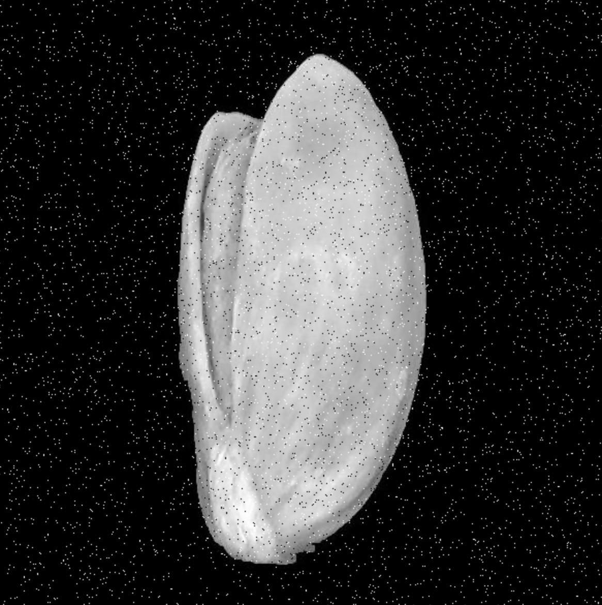

# CS 506 Midterm Report: Noise Reduction in Images

**Authors:** Ashtosh Bhandari, Varada Rohokale, Zev Fine  
**YouTube:** [https://www.youtube.com/watch?v=AlRKTor6PYk](https://www.youtube.com/watch?v=AlRKTor6PYk)

---

## Description

The aim of this project is to develop algorithms—and, if time permits, deep learning models—that take noisy images and produce clearer, more interpretable versions. We will apply classical techniques and reverse-engineer different noise processes to mitigate their effects, striving to preserve the original content as much as possible.

This work is relevant to surveillance, medical imaging, satellite imagery, and restoration of historical photos, where “good enough to recognize content” is often the practical goal.

## Main Goal

Reduce noise in images to reveal key visual information that may be obscured or blurred.

---

## Data

1. **Existing datasets**
   - https://www2.eecs.berkeley.edu/Research/Projects/CS/vision/bsds/
   - https://www.kaggle.com/datasets/muratkokludataset/pistachio-image-dataset
   - https://www.kaggle.com/datasets/gpiosenka/sports-classification
   - https://www.kaggle.com/datasets/vishalsubbiah/pokemon-images-and-types

2. **Synthetic noise**
   - We will add Gaussian, Poisson, Salt-and-Pepper, and Speckle noise.
   - **Preliminary visuals**  
     **a. Gaussian Noise**  
     

     **b. Poisson Noise**  
     

     **c. Salt & Pepper**  
     

     **d. Speckle**  
     

---

## Methods for Noise Reduction

1. **Classical/Mathematical techniques**
   - *Gaussian noise*: frequency-domain filtering
   - *Poisson noise*: Anscombe transform (+ denoising in transformed domain)
   - *Salt-and-Pepper (black & white) noise*: clustering/median-style approaches
   - *Speckle noise*: log-transform followed by Gaussian smoothing

2. **Deep learning (if time permits)**

---

## Evaluation & Visualization

- **Side-by-side comparisons**: show *before → after → target*.
- **Quality metrics**: SSIM, PSNR, entropy / noise variance / noise std.
- **Preliminary results (Gaussian example)**  
  
- **RGB difference maps**: visualize per-channel change.
- **Targeted examples**: where methods work well/poorly (faces, backgrounds, buildings, etc.).

---

## Test Plan

1. **Partitioning**  
   For each dataset: ~65% train, 10% validation, 25% test.
2. **Training**  
   Train on the designated training split.
3. **Validation**  
   Hyperparameter tuning to balance denoising strength vs. detail preservation.
4. **Testing**
   - Compare each image to its denoised counterpart (pixel-level and metric-based).
   - Use pretrained recognition models to check whether main semantics are retained.  
     For example, run a clean image through a classifier to get a label, then run the denoised version and measure consistency/similarity.
